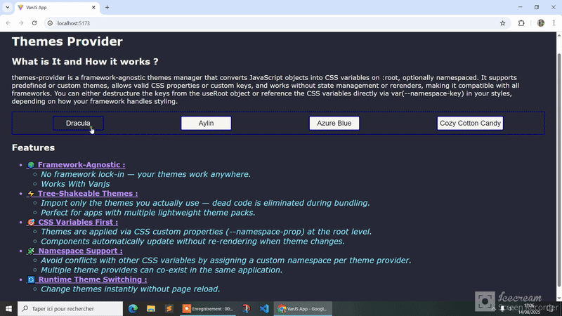

# Themes Provider
Universal, Tree-Shakeable, Framework-agnostic Theme Management, that converts JavaScript objects into CSS variables on `:root`, optionally namespaced.
<div align="center"> 


</div>
## Features
- ***🌍 Framework-Agnostic :***
    - No framework lock-in — your themes work anywhere.
    - Works with :`Zikojs`, `Vanjs`, `React`, `Preact`, `Svelte`, `Vue`, `Solid`, `Vanilla JS`, and more.
- ***⚡ Tree-Shakeable Themes :***
    - Import only the themes you actually use — dead code is eliminated during bundling.
    - Perfect for apps with multiple lightweight theme packs.
- ***🎯 CSS Variables First :** 
    - Themes are applied via CSS custom properties (--namespace-prop) at the root level.
    - Components automatically update without re-rendering when theme changes.
- 🧩 Namespace Support : 
   - Avoid conflicts with other CSS variables by assigning a custom namespace per theme provider.
   - Multiple theme providers can co-exist in the same application.
- 🔄 Runtime Theme Switching :
    - Change themes instantly without page reload.
- 🛠 Simple API
<!-- - ♻ Multiple Usage Modes -->

## Demos
- **`Zikojs :`** 
- **`Vanjs :`** https://stackblitz.com/edit/zakarialaoui10-themes-provider-fundxkwo?file=src%2FApp.js
<!-- - **`React :`** 
- **`Preact :`** 
- **`Solid :`** 
- **`Svelte :`** 
- **`Vue :`** 
- **`Astro :`**  
- **`Angular :`** 
- **`Qwik :`**  
- **`Alpine :`** 
- **`Htmx :`**  
- **`Marko :`**  -->
## Install
```bash
npm i themes-provider
```

## Process

- Themes Declarations 
```js
const Themes = {
    T1 : {
        border : '1px darkblue solid',
        color : 'darkblue',
        bg : 'white'
    },
    T2 : {
        border : '1px darkblue solid',
        color : 'darkblue',
        bg : 'white'
    }
}
```

- Applying a Theme to :root with useTheme

```js
import {useTheme} from 'themes-provider'
const T = useTheme(Themes.T1, {namespace : th})
```
This assigns the properties from `Themes.T1` as CSS variables on `:root`, It's equivalent to:
```css
:root{
   --tt-border : 1px darkblue solid;
   --tt-color : darkblue;
   --tt-bg : white;
 }
```
- Applying the style
You can use two approaches:
  - Using destructuring (when applying styles directly in JavaScript)
  ```js
  const {border, color, bg} = T
  ```
  - Using Css Variable derictly 
  ```css
  [selector]{
    border : var(--tt-border);
  }
  ```
The choice of approach depends on the targeted framework itself.

- Updating the theme dynamically 
```js
A.use(Themes.T2) 
```
This instantly updates the styles applied to :root, without requiring state management or component re-rendering.
